**Expense Tracker**
A Flutter-based mobile app for managing personal finances, featuring AI-powered receipt scanning, secure cloud integration, and full-stack architecture.

## Table of Contents
- [Features](#features)
- [AI Demo Video](#-ai-demo-video)
- [Screenshots](#-screenshots)
- [Technology Stack](#technology-stack)
- [Learning & Future Plans](#learning--future-plans)
- [Getting Started](#getting-started)
- [Running Tests](#running-tests)

## About
Expense Tracker is a Flutter-based mobile application designed to help users easily manage and monitor their personal finances.  
With a clean and intuitive interface, users can add, edit, and track their expenses across different categories, allowing for better budgeting and financial awareness. 

##  Features

- **User Authentication**  
  Secure sign-in and sign-up using Firebase Authentication, including email/password and Facebook login.

- **App Sharing**  
  Share the app with friends directly from the app bar via social platforms like Facebook and Instagram, implemented using the `share_plus` package.

- **Welcome Page**  
  A clean and user-friendly welcome screen guiding users to log in or sign up.

- **Home Screen**  
  Displays all expense and income records for the selected month, with data stored in Firebase. Users can quickly add new records from here.

- **AI-Powered Record Creation**  
  Users can scan receipts using their device’s camera. The app uses AI via Cloud Function to extract receipt data and auto-fill the form, including suggesting likely categories.

- **Analysis Screen**  
  Visualizes income and expense data with interactive pie charts, helping users understand their financial activity for the selected month.

- **History Screen**  
  Shows a complete list of past records. Data is retrieved from Firestore via Google App Engine, showcasing backend integration.

- **Account Screen**  
  Allows users to manage and update their personal information. Changes are processed through App Engine and stored in a PostgreSQL database, demonstrating full-stack capabilities.

## 🎥 Demo Video
Watch the AI-powered receipt scanning in action:

[![AI Receipt Scanning Demo]](https://youtube.com/shorts/Y-E_I1GCtMk?feature=share)
*(Follow the link to view the full process)*

## 🖼️ Screenshots

### 🔐 Welcome Screen  
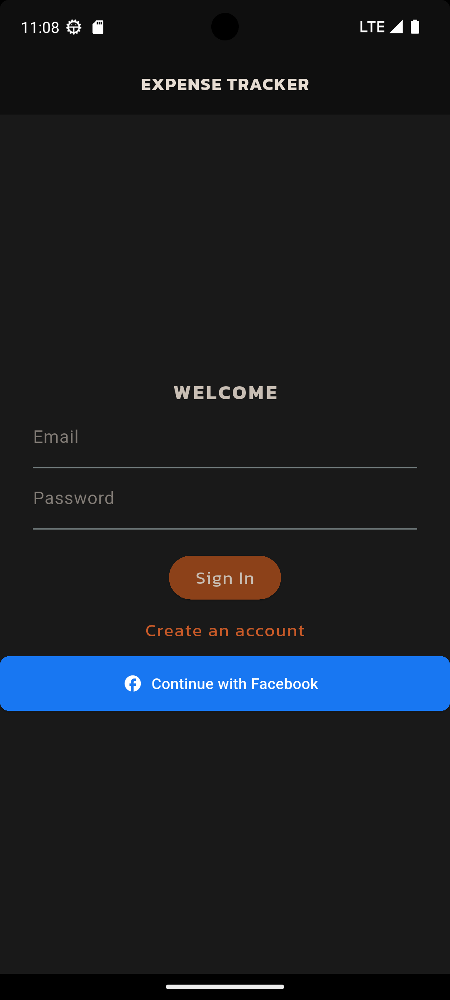  
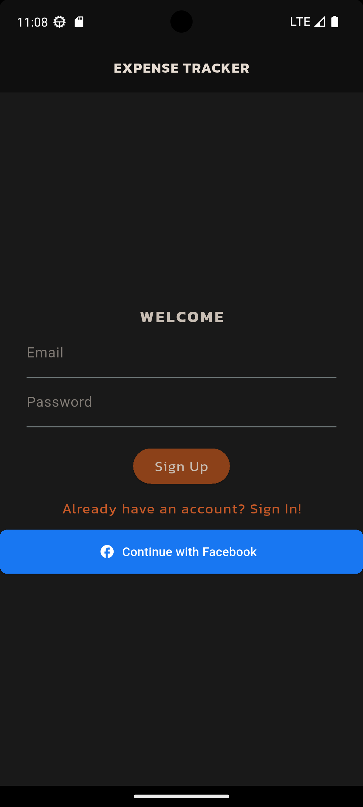  
 
The entry point of the app. Users can log in or sign up using Firebase Authentication, including Facebook login.

---

### 🏠 Home Screen  
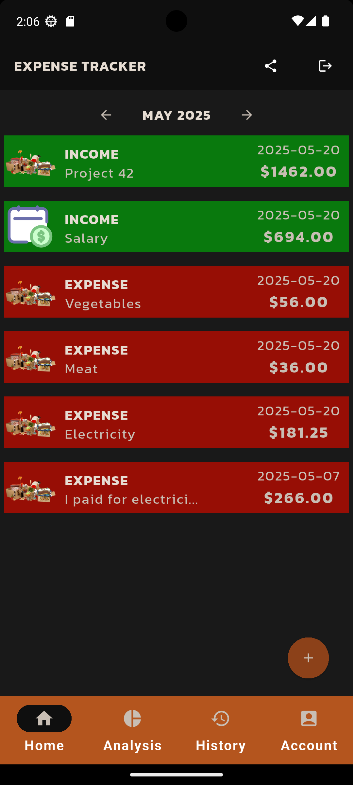  
Displays all expenses and incomes for the selected month. User can open a new record form from this screen by clicking on '+' button.

---

### ➕ New Record Screen  

This feature allows users to add a new income or expense by either filling out a form manually or scanning a receipt using AI.  
The process uses a camera, Cloud Functions, and a Gemini-powered suggestion system.

---

#### 🖼 Step 1 – Open the New Record Screen  
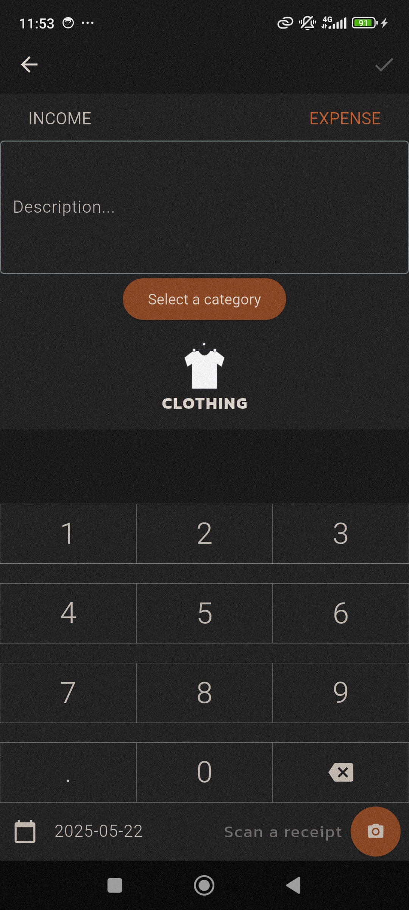  

- Users can toggle between **Income** and **Expense**.  
- Users can manually fill in the fields or tap the **camera button** 📷 to start creating a new record using the camera (available only for expenses).  
- The **Save** button remains disabled until all required fields are properly filled, ensuring data completeness.

---

#### 📷 Step 2 – Tap "Scan a Receipt"  
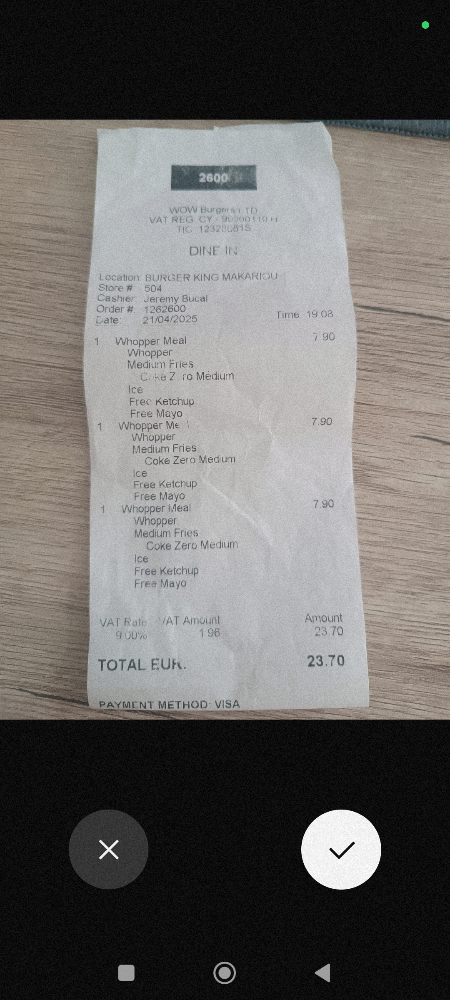  
After user presses 'scan a receipt', the app opens the camera interface to scan a physical receipt.

---

#### ☁️ Step 3 – Waiting for Cloud Function Response  
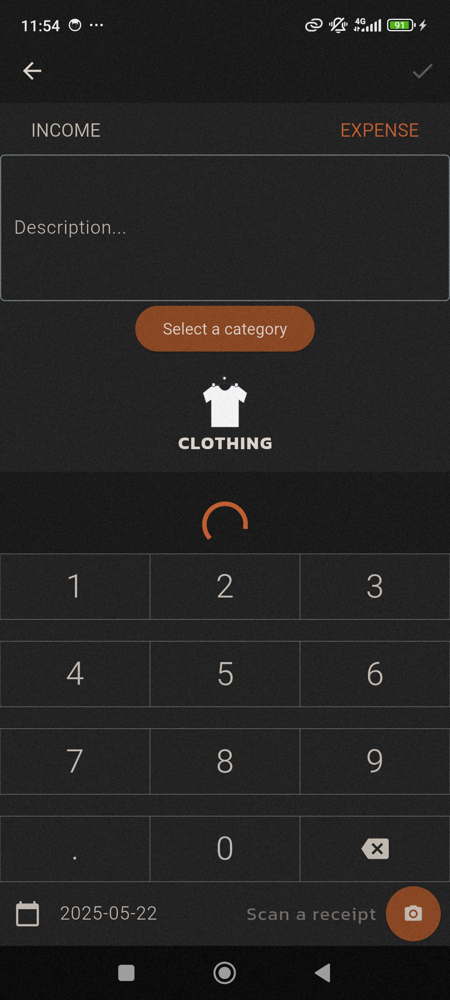  

Once the user scans the receipt, the image is uploaded to Firebase Storage.  
After the upload, Flutter retrieves the image URL and sends a request to a Cloud Function with this URL.  
The Cloud Function forwards the image link to a Gemini AI model via Google Vertex AI.  
Gemini processes the image and extracts key data (such as amount, date, and description).  
Finally, the Cloud Function returns the extracted data to the app to pre-fill the form.

The UI displays a circular progress indicator while this process is ongoing.

---

#### ✨ Step 4 – Auto-populated fields  
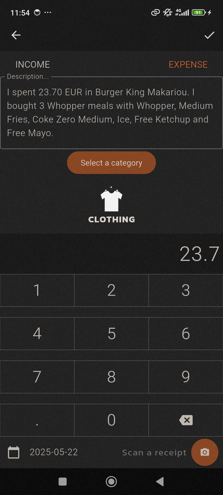  
The app auto-fills form fields such as amount, date, and description based on the extracted data.

---

#### 🧠 Step 5 – Category Suggestions Using Gemini  
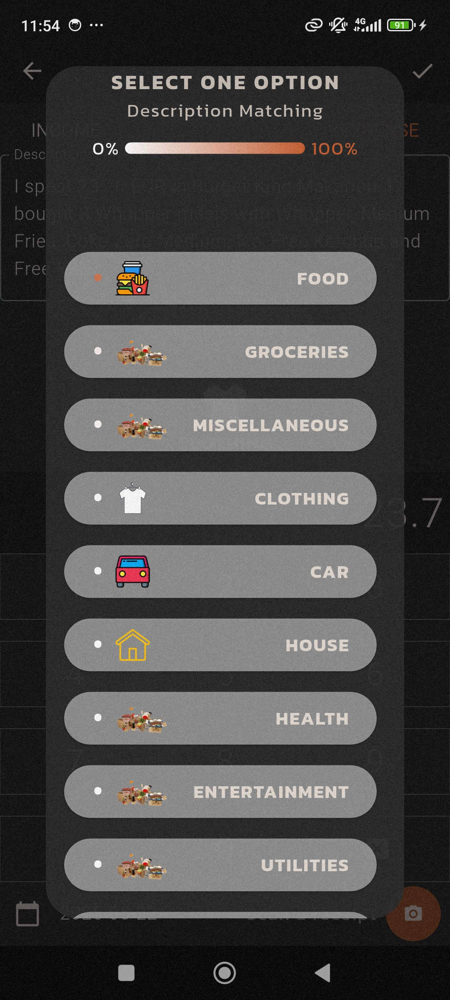  

The category field is not auto-filled. Instead, the user selects a category from a list, where the top three suggestions — sorted by AI-based confidence — are shown first for convenience.  

A request containing the description and possible options is sent to a Cloud Function, which creates a prompt for Gemini and sends the request directly to the Gemini API.  
Based on Gemini's response, the Cloud Function sends the data back to Flutter, which sorts the categories and displays them in a popup for the user to choose from.

---

#### ✅ Step 6 – Final Populated Form  
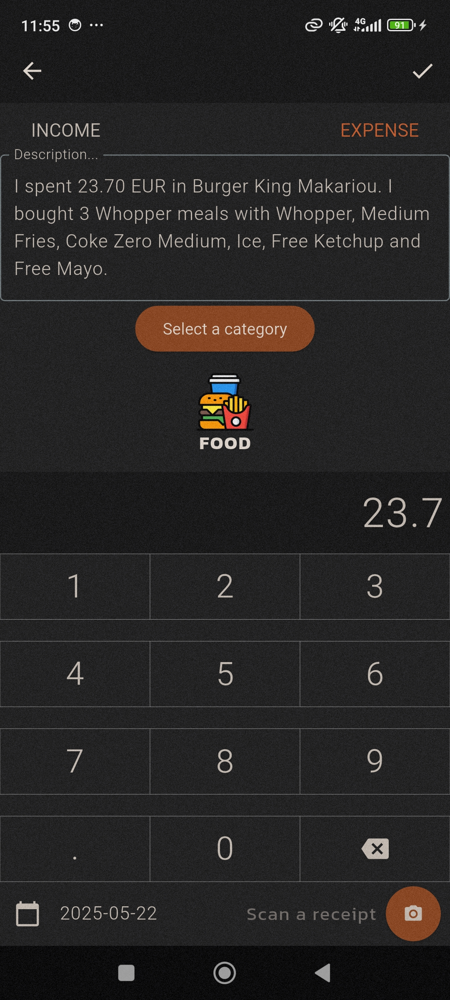  
The user reviews the auto-filled data, makes any necessary adjustments, and saves the record.  
The data is then securely stored in Firestore for future access and analysis.

---

### 📊 Analysis Screen  
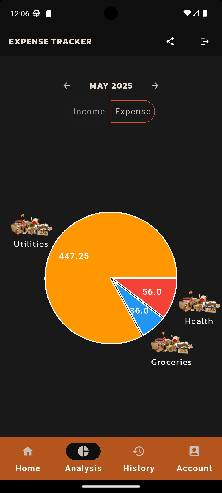  
Shows expense or income distribution for the selected month using interactive pie charts.

---

### 📜 History Screen  
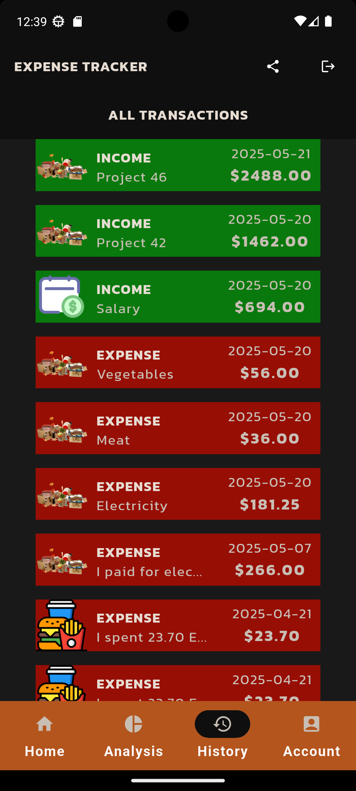  

This screen displays a list of all transactions the user has stored in Firestore.  
This screen uses the architecture that simulates a real-world client-server interaction using Firebase Authentication, Google App Engine, and Firestore.
It ensures better security and scalability compared to direct Firestore access.
It demonstrates the integration and communication flow between **Flutter**, **App Engine**, **Firestore**.  

---

### 👤 Account Screen  
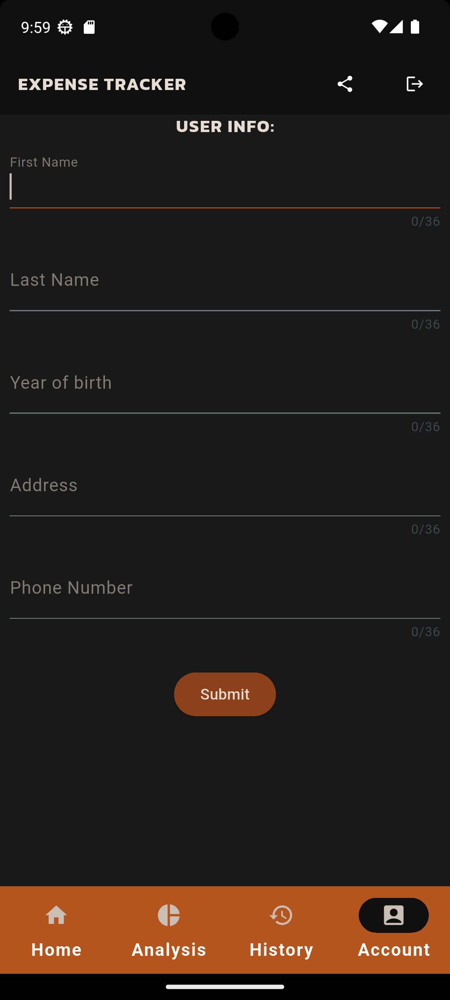  
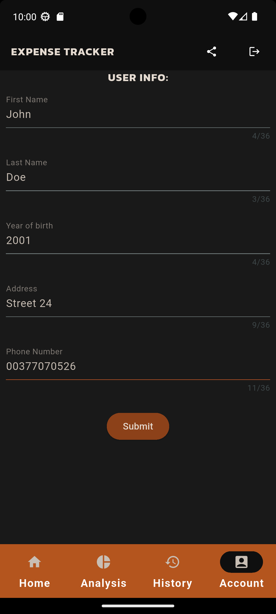  
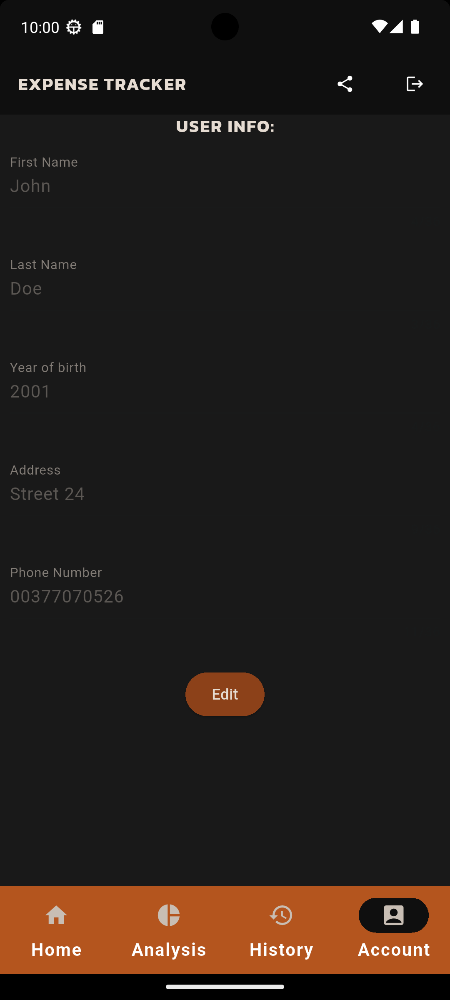  
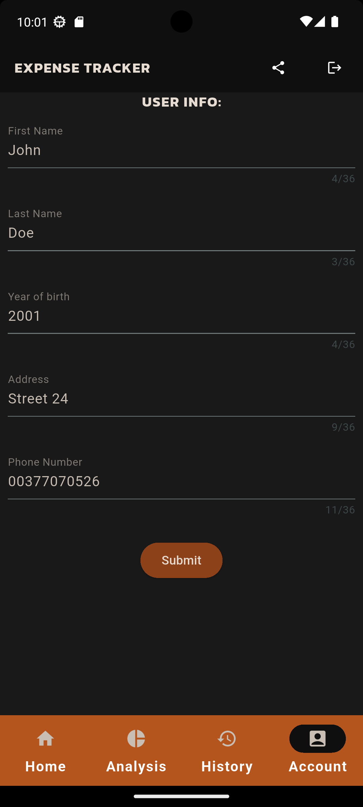  
  
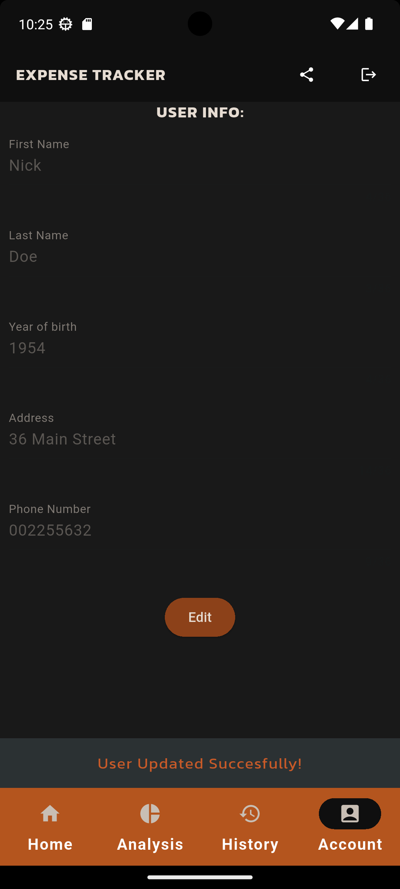  
The Account screen allows the user to enter and update personal information.
It demonstrates a real-world client–server architecture using **Flutter, Firebase Authentication, App Engine, and a PostgreSQL database hosted on Cloud SQL**.
The app communicates with App Engine through authenticated HTTP requests, including headers with Firebase ID tokens for secure access.
This ensures that only authorized users can update their information and keeps sensitive data secure on the server side.

## Learning & Future Plans

This project has been my hands-on Flutter learning journey—from a simple prototype to today’s polished New Record screen (which I’ll continue refining). I’m committed to continuous improvement and plan to:

- Refactor the codebase for cleaner architecture and replace suboptimal widgets with more appropriate alternatives.  
- Expand unit and widget tests to cover more UI flows and edge cases.
 

## Getting Started
### Prerequisites
Flutter SDK 
Dart (comes with Flutter)
A connected emulator or physical device
Firebase project 
Google Cloud project

### Installation
Step-by-step instructions on how to set up the project locally:

git clone https://github.com/MilenkoTrifkovic/ExpenseTracker2.0.git
cd your-repo
flutter pub get
flutter run
## Running Tests

The app includes basic unit tests for the `GeminiServices` class, ensuring that AI-powered category suggestions are handled correctly via Cloud Functions.  
The tests use `flutter_test` and `mocktail` for mocking HTTP requests and notifier behavior.

To run all tests:
flutter test

## Navigation

- **Mobile & Tablet**  
  Uses a **NavigationBar** at the bottom to switch between screens.

- **Desktop**  
  Intended to show a **NavigationRail** on the side for sidebar-style navigation.  
  > **Note:** Desktop support is experimental and not extensively tested.

## Firebase Firestore  
The app uses **Firebase Firestore** to store and retrieve records.

## State Management with Riverpod  
- **StreamProvider**: Manages user authentication state.  
- **NotifierProvider**: Retrieves and manages records from Firestore.

## Technologies Used  
- **Firebase Authentication**: For user sign-in and sign-up.  
- **Firebase Firestore**: For storing and dynamically retrieving user records.  
- **Firebase Storage**: For storing scanned receipt images.  
- **Flutter**: Framework for building the mobile app.  
- **Riverpod**: For state management
- **Google Fonts**: For custom fonts in the UI.  
- **fl_chart**: For visualizing data via charts (pie charts, etc.).  
- **Date Picker**: For selecting transaction dates.  
- **TweenSequenceAnimation**: For advanced UI animations.  
- **showModalBottomSheet**: For displaying modal sheets when creating records.  
- **Google App Engine**: Backend server handling requests and data processing.  
- **Cloud Functions**: For AI-powered receipt scanning and data extraction.  
- **PostgreSQL (Cloud SQL)**: For storing user account info.  
- **Facebook Authentication**: Allows login using Facebook accounts.  
- **share_plus** Flutter package: Enables sharing the app via social platforms.  
- **http & dio**: For making REST API requests.  
- **flutter_cache_manager**: For efficient caching of network images and files.  
- **image_picker**: For selecting images from camera or gallery.  
- **virtual_keyboard_custom_layout**: For custom virtual keyboard input.  
- **uuid**: For generating unique IDs.    
- **intl**: For internationalization and date/number formatting.  
- **path_provider**: For accessing commonly used locations on the filesystem.

